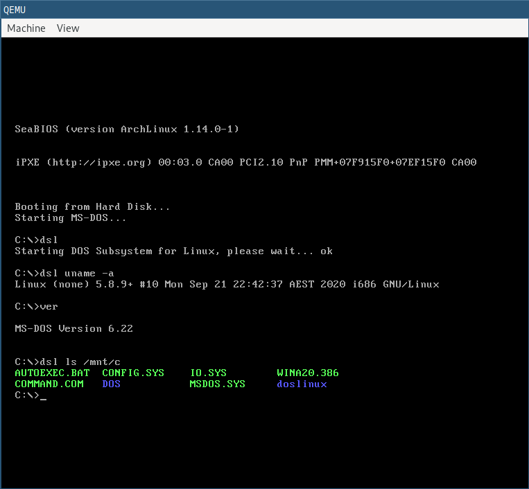

# DOS Subsystem for Linux

A WSL alternative for users who prefer an MS-DOS environment.

[Video](https://charlie.su/doslinux_demo-f5c2031c25d47a.mp4)

## Building

* Clone and build Linux 5.8.9 under `linux-5.8.9/`. Use the `linux-config-doslinux` file in the root of this repo as your `.config`

* Clone and build Busybox 1.32.0 under `busybox-1.32.0`. Use `busybox-config` likewise

* You will also need an installed copy of MS-DOS in `hdd.base.img`.

* Run `make`

